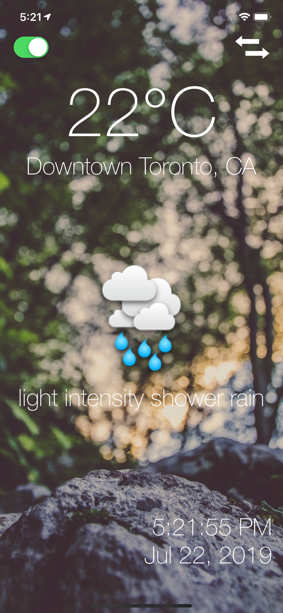
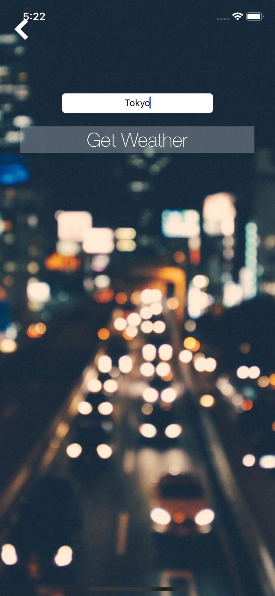
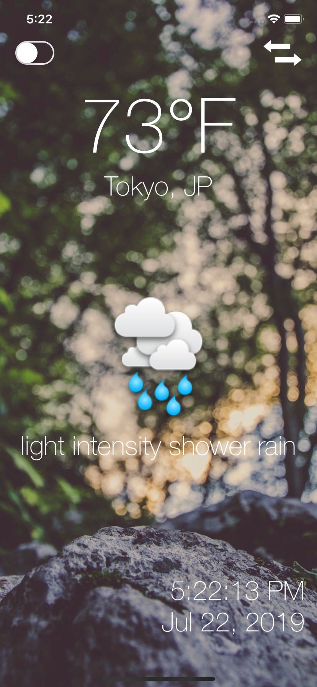
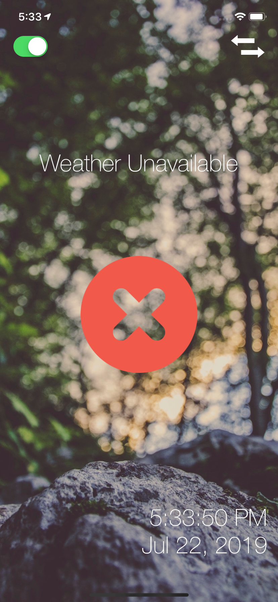

# weather-app

An iOS app that displays the current weather at the users GPS location, obtained from <a href="https://openweathermap.org/">OpenWeather</a>. Shows weather in Celcius by default, includes switch to convert to Fahrenheit. Displays the city, an animated icon, a short description, and the current date and time (updated live). Allows user to manually enter a location and retrieve data for that input. If an uknown location is entered, an error message is shown.

